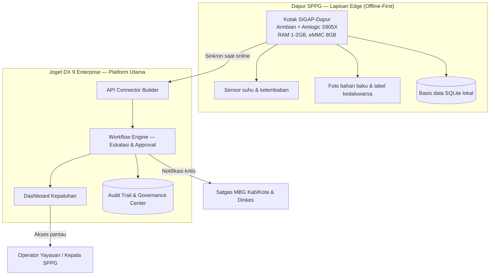

# SIGAP-Dapur
### Sistem Inspeksi Gizi Aman Pangan — Edge Compliance & Early-Warning untuk Dapur SPPG Program MBG

**Riset produk modul offshore Joget DX**
Disusun untuk: Tim Senior Software Engineer (1–5 orang) — metodologi *vibe coding*
Tanggal riset: Selasa, 28 Juli 2026

---

> **Satu kalimat inti:** SIGAP-Dapur adalah kotak *edge computing* seharga di bawah Rp500 ribu (Armbian di atas chipset Amlogic S905X bekas TV box) yang dipasang di dapur SPPG untuk mendeteksi dan mencegah risiko keracunan pangan MBG secara *real-time* dan *offline-first*, tersambung ke pusat kendali berbasis **Joget DX 9 Enterprise** untuk workflow eskalasi, audit trail, dan dashboard kepatuhan bagi operator dapur dan Satgas MBG.

---

## Lembar Keputusan (Ringkasan Jawaban atas Brief Anda)

| Parameter yang diminta | Keputusan |
|---|---|
| Kategori | Konvergensi dari **OCR/doc extractor + Patrol Data Collector + IoT**, diterapkan pada **Program MBG** |
| Target konsumen | **B2C / Layanan Publik** (bukan B2B) — lihat justifikasi di Bab 8 |
| Jenis modul (dipilih satu) | **Modul edge di Armbian SBC chipset Amlogic S905X** (opsi yang Anda sebutkan eksplisit), terhubung ke **plugin Joget DX 9** sebagai backend |
| Platform utama | **Joget DX 9 Enterprise** tetap jadi otak workflow/dashboard/governance — tidak tergeser |
| Platform alternatif (edge) | Stack ringan non-Joget (Python/Node + SQLite + PWA) khusus di kotak edge, sesuai izin Anda untuk pakai platform lain yang lebih relevan/murah |
| Tim & metode | 1–5 senior software engineer, *vibe coding* dengan AI coding assistant |

---

## 1. Metodologi Riset & Proses Seleksi

Untuk mencapai standar "setara inventor, profesor, dan guru besar" yang Anda minta, riset ini dilakukan lewat tiga jalur paralel per 28 Juli 2026:

1. **Pengecekan orisinalitas** — Saya mencoba meng-crawl folder Google Drive "Joget Offshores" yang Anda lampirkan. **Catatan penting:** folder Google Drive di-render lewat JavaScript dan memerlukan otorisasi login, sehingga saya hanya berhasil mengambil judul foldernya, bukan daftar dokumen di dalamnya. Saya tidak bisa memastikan 100% ide ini belum pernah dikerjakan kantor Anda. Sebagai mitigasi: (a) saya memilih ide yang sangat spesifik dan terikat pada peristiwa Juli 2026 (kecil kemungkinan sudah ada di arsip lama), dan (b) saya sarankan Anda cross-check cepat sendiri dengan kata kunci "MBG", "SPPG", "gizi", "food safety", atau "Amlogic" di Drive tersebut sebelum eksekusi. Jika Anda menghubungkan Google Drive sebagai connector di percakapan ini, saya bisa langsung memindai isinya di pesan berikutnya.
2. **Riset kelayakan platform** — validasi kapabilitas Joget DX 9 Enterprise terkini dan kelayakan teknis Armbian di chipset Amlogic S905X.
3. **Riset kebutuhan pasar** — pemindaian lebih dari selusin kategori yang Anda contohkan, dicocokkan dengan peristiwa aktual per akhir Juli 2026.

### Kandidat yang dipertimbangkan dan alasan tidak dipilih

| Kandidat ide | Kategori | Alasan tidak dipilih |
|---|---|---|
| OCR/klasifikasi dokumen KYC perbankan | B2B — Banking | Pasar sudah sangat jenuh (ABBYY, Google Document AI, banyak startup lokal); klien perbankan Anda kemungkinan besar sudah pernah digarap kantor Anda sehingga risiko duplikasi tinggi |
| CRM/ERP sektor tambang | B2B — Mining | Kategori generik, sudah jadi *bread-and-butter* banyak vendor Joget; sulit diklaim "unik" |
| Komunitas pecinta kucing | B2C — Komunitas | Kebutuhan bisnis lemah, kalah bersaing dengan grup Facebook/Discord yang sudah mengakar; tidak memanfaatkan kekuatan workflow Joget DX |
| Orkestrasi AI Agent/MCP | AI Agent | Sangat ramai (n8n, LangChain, dst di 2026); sinergi dengan Joget DX rendah karena ini murni tool developer, bukan modul bisnis |
| Emulator retro game | Game-Based Tool | Menarik tapi bukan kebutuhan bisnis mendesak; tak ada urgensi "hari ini" |
| **Sistem cegah-keracunan dapur SPPG MBG (SIGAP-Dapur)** | **Program MBG + OCR + Patrol + IoT** | **Terpilih** — urgensi terverifikasi dengan data insiden 4 hari terakhir, ~27.820 unit dapur sebagai pasar, celah yang jelas dari solusi BGN yang ada, dan cocok persis dengan spesifikasi hardware Armbian S905X yang Anda sebutkan |

---

## 2. Mengapa Sekarang? Konteks & Urgensi per 28 Juli 2026

Ini bukan ide spekulatif — berikut rangkaian fakta yang saya kumpulkan, seluruhnya terjadi dalam beberapa bulan hingga beberapa hari terakhir:

### 2.1 Skala program
Program Makan Bergizi Gratis (MBG) kembali beroperasi penuh sejak 13 Juli 2026 setelah jeda evaluasi 22 Juni–13 Juli 2026 yang sengaja diambil Badan Gizi Nasional (BGN) untuk <cite index="18-1,18-2">standardisasi tata kelola operasional Satuan Pelayanan Pemenuhan Gizi (SPPG) selama Tahun Anggaran 2026</cite>. <cite index="18-3">Per data terakhir, terdapat sekitar 27.820 SPPG yang beroperasi di seluruh Indonesia</cite>, masing-masing menerima <cite index="18-4">insentif operasional sebesar Rp6 juta per hari saat beroperasi normal</cite>. Ini adalah pasar dengan puluhan ribu titik instalasi — skala yang jarang ditemui untuk modul niche.

### 2.2 Krisis keamanan pangan yang nyata dan berkelanjutan
Data akademik dan pemerintah menunjukkan pola yang konsisten:

| Sumber & periode | Temuan |
|---|---|
| Analisis The Conversation (data 2025) | <cite index="19-1,19-2">177 kejadian luar biasa (KLB) akibat keracunan MBG di 127 kabupaten/kota dan 33 provinsi</cite>, dengan <cite index="19-3">lebih dari 20 ribu kasus keracunan</cite> |
| Kementerian Kesehatan (medio 2026) | <cite index="21-1">446 kasus keracunan program MBG dengan total 37.693 korban gangguan pencernaan massal di 220 kabupaten/kota</cite> |
| Akar masalah (wawancara 162 petugas surveilans) | <cite index="19-4,19-5">Petugas dapur SPPG memasak tanpa alat pelindung diri lengkap, praktik cuci tangan buruk, serta penyimpanan bahan mentah pada suhu yang tidak tepat</cite>; <cite index="19-6">dinas kesehatan daerah tidak dilibatkan optimal dalam perencanaan dan pemantauan</cite>; sertifikasi <cite index="19-7">laik higiene sanitasi (SLHS) baru diwajibkan sejak September 2025</cite> |

**Insiden konkret dalam 6 bulan terakhir** (bukan hipotetis — semuanya nyata dan terverifikasi lewat pemberitaan):
- 30 Jan 2026 — SMA 2 Kudus, ratusan porsi terdampak.
- 6 Feb 2026 — Jember, 112 korban (99 siswa + 13 guru).
- 10–11 Feb 2026 — Lombok Tengah: <cite index="23-1">38 siswa keracunan karena susu kemasan kedaluwarsa terkontaminasi bakteri Escherichia coli, Staphylococcus aureus, dan Bacillus cereus</cite> — persis kasus yang bisa dicegah lewat verifikasi tanggal kedaluwarsa otomatis.
- 29 April 2026 — Kronjo, Tangerang: 33 siswa keracunan; SPPG-nya <cite index="25-1">bahkan belum mengurus SLHS</cite> saat insiden terjadi.
- 16 Juli 2026 — Jember (lokasi berbeda), evaluasi total pasca-KLB.
- **24 Juli 2026 (4 hari sebelum tanggal riset ini)** — Pesawaran, Lampung: <cite index="22-1">33 siswa dan seorang guru SD Negeri 22 Tegineneng mengeluh mual, muntah, hingga sakit kepala usai menyantap menu MBG</cite>.

### 2.3 Respons pemerintah sedang berlangsung — dan celahnya jelas terlihat
Sehari sebelum tanggal riset ini (27 Juli 2026), Kepala BGN Sudaryono mengumumkan bahwa BGN <cite index="32-1">telah memberhentikan 261 pegawai non-ASN terkait kedisiplinan dan menutup permanen 833 SPPG di sejumlah wilayah Indonesia terkait pelanggaran</cite>. Di konferensi pers yang sama, BGN mengumumkan <cite index="30-1,30-2">sedang menyiapkan ekosistem digital agar masyarakat—terutama orang tua siswa—dapat mengetahui sekolah, menu, dapur, dan kepala SPPG yang bertanggung jawab</cite>, dengan akses <cite index="32-2">berbasis log-in NIK untuk melindungi data pribadi siswa</cite>. Terpisah, sejak Oktober 2025 BGN <cite index="31-1">mewajibkan SPPG mengunggah foto dan video kegiatan operasional sebagai syarat pencairan dana tahap berikutnya</cite>.

**Ini justru memperkuat, bukan melemahkan, ide SIGAP-Dapur — dengan catatan penting:** kedua inisiatif BGN itu bersifat *informational/transparency* dan *proof-of-activity* (foto/video untuk pencairan dana; portal untuk orang tua melihat menu), **bukan** sistem pencegahan real-time berbasis sensor di titik memasak. Tidak satu pun dari sumber yang saya temukan menyebut BGN memiliki alat pemantauan suhu, verifikasi kedaluwarsa otomatis, atau mekanisme peringatan dini yang berjalan *offline* di dapur terpencil. Saya juga menemukan produk pihak ketiga "Kantor Kita" yang memonitor SPPG, tapi fokusnya adalah <cite index="29-1">absensi online dan pelaporan aktivitas dapur</cite> — bukan keamanan pangan. **Ini adalah celah yang belum terisi**, dan menjadi dasar diferensiasi SIGAP-Dapur.

---

## 3. Definisi Masalah

Menyaring akar masalah dari riset di atas menjadi kebutuhan teknis:

1. **Tidak ada pencegahan real-time** — pelanggaran (suhu penyimpanan salah, bahan kedaluwarsa) baru diketahui setelah siswa sakit, bukan sebelum makanan didistribusikan.
2. **Konektivitas tidak bisa diandalkan** — banyak SPPG berada di desa/kecamatan dengan sinyal internet lemah, sehingga sistem berbasis cloud murni tidak realistis untuk operasional harian.
3. **SLHS dan checklist kepatuhan masih berbasis kertas/manual** — rentan dilewati saat dapur sedang sibuk melayani ribuan porsi.
4. **Pengawasan lapangan (sidak Satgas MBG) bersifat reaktif**, dilakukan setelah insiden viral, bukan preventif berkala.
5. **Biaya jadi penghalang** — mayoritas SPPG dikelola yayasan/UMKM lokal dengan margin tipis (insentif Rp6 juta/hari sudah harus menutupi bahan baku, tenaga kerja, dan operasional); solusi apa pun yang mahal tidak akan diadopsi.

---

## 4. Solusi yang Diusulkan: SIGAP-Dapur

**SIGAP-Dapur** (Sistem Inspeksi Gizi Aman Pangan) adalah kombinasi kotak *edge device* murah + backend Joget DX yang bekerja dalam dua lapis:

- **Di dapur (edge, offline-first):** kotak kecil berbasis Armbian + Amlogic S905X memandu petugas dapur lewat checklist digital (APD, cuci tangan, suhu penyimpanan), membaca suhu lewat sensor murah, memindai label/struk bahan baku dengan OCR ringan untuk mengecek tanggal kedaluwarsa, dan memberi **peringatan lokal seketika** — semua tanpa butuh internet aktif.
- **Di pusat kendali (Joget DX 9 Enterprise):** workflow eskalasi otomatis ke Satgas MBG/Dinkes saat ada pelanggaran berulang, dashboard status kepatuhan seluruh dapur dalam satu wilayah, audit trail untuk keperluan perpanjangan SLHS dan pertanggungjawaban dana BGN.

Filosofi produk: **jadikan kepatuhan lebih mudah daripada pelanggaran**, dan berikan operator dapur "asuransi operasional" terhadap risiko penutupan permanen yang kini nyata terjadi pada ratusan SPPG.

---

## 5. Arsitektur Teknis

### 5.1 Lapisan Edge — Kotak SIGAP-Dapur
- **Hardware:** Android TV box bekas/baru berchipset Amlogic S905X, RAM 2GB, eMMC 8GB — di pasar Indonesia harganya berkisar **Rp200.000–700.000** per unit tergantung merek dan RAM. Chipset ini didukung matang oleh komunitas Armbian lewat proyek-proyek open source yang aktif (mengubah TV box Android menjadi server Linux mini yang bisa ditulis ke eMMC internal).
- **OS:** Armbian (build komunitas untuk keluarga chipset Amlogic S9xxx — perlu dicatat ini bukan dukungan resmi Armbian, sehingga QA internal tetap diperlukan sebelum rollout massal).
- **Software edge:** aplikasi web ringan (Python/Flask atau Node.js/Express) yang disajikan sebagai **PWA (Progressive Web App)** lokal — bisa diakses staf dapur lewat WiFi hotspot dari kotak itu sendiri, tanpa perlu internet.
- **Fungsi inti:**
  - Checklist digital pra-masak (APD, cuci tangan) dengan validasi wajib isi sebelum proses masak "dibuka" di sistem.
  - Pembacaan suhu penyimpanan bahan mentah via sensor murah (mis. DS18B20/DHT22) yang disambungkan ke kotak; ambang batas suhu tidak aman memicu **alarm lokal seketika** sebelum bahan dipakai.
  - OCR ringan (mis. varian Tesseract yang dioptimalkan) untuk memindai tanggal kedaluwarsa pada label kemasan bahan baku (susu, protein olahan, dsb.) — langsung menyasar akar penyebab kasus keracunan susu kedaluwarsa di Lombok Tengah.
  - Basis data lokal SQLite menyimpan semua data sebagai buffer; sinkronisasi ke server pusat terjadi otomatis begitu ada koneksi (WiFi/hotspot HP petugas), mengirim ringkasan terkompresi + notifikasi kritis saja (agar hemat kuota dan tidak membebani server).
- **Kenapa bukan Joget yang jalan langsung di kotak ini?** Joget adalah platform Java/Tomcat kelas enterprise — terlalu berat untuk RAM 1–2GB. Ini justru sesuai izin Anda untuk memakai "platform lain yang relevan dan lebih murah" khusus di titik yang memang butuh itu, sementara Joget DX tetap jadi otak sistem di lapisan pusat.

### 5.2 Lapisan Sinkronisasi
Desain *store-and-forward*: data tersimpan aman secara lokal, dan hanya ringkasan terverifikasi + foto terkompresi yang dikirim saat ada sinyal. Ini membuat sistem tetap berfungsi penuh di dapur-dapur pelosok yang jadi mayoritas dari 27.820 SPPG di seluruh Indonesia.

### 5.3 Lapisan Backend — Joget DX 9 Enterprise
Riset menunjukkan Joget DX 9 (rilis umum sejak September 2025, dengan pembaruan berkelanjutan sepanjang 2026) memiliki fitur yang pas untuk kasus ini:
- <cite index="7-1,7-2">Marketplace terintegrasi untuk menemukan, memasang, dan mengelola plugin langsung dari platform, plus API Connector Builder no-code untuk integrasi sistem eksternal</cite>.
- <cite index="7-3">Kontrol enterprise lewat keamanan lanjutan, kepatuhan, dan tata kelola — termasuk monitoring bawaan, audit trail, dan governance center</cite> — persis yang dibutuhkan untuk keperluan pelaporan SLHS/BGN.
- Kepatuhan terhadap **standar GovStack** menjadikannya relevan untuk konteks program pemerintah seperti MBG.
- Joget sendiri telah terbukti pada skala nasional Indonesia — dipakai <cite index="10-1">perusahaan telekomunikasi besar untuk rollout nasional di negara berpenduduk lebih dari 280 juta jiwa lewat ratusan pod Kubernetes cloud-native</cite>.
- AI Designer/App Composer memungkinkan pembuatan form, workflow, dan dashboard lewat perintah bahasa natural — selaras langsung dengan semangat *vibe coding* yang Anda minta; Joget bahkan secara eksplisit memasarkan kombinasi "Vibe Composition dengan Agentic AI" di materi produk terbarunya.
- Plugin dikembangkan sebagai **Standard Java Plugin atau Dynamic OSGi Plugin** berbasis Maven, dan bisa didistribusikan/dijual lewat Joget Marketplace — membuka opsi model bisnis *white-label* untuk wilayah lain (relevan dengan minat Anda soal skema *service charge/admin-fee*).

**Fungsi di backend:** registrasi & onboarding SPPG dan kotak edge-nya, workflow eskalasi otomatis (notifikasi ke Satgas MBG saat pelanggaran suhu berulang atau bahan kedaluwarsa terdeteksi), dashboard kepatuhan real-time (hijau/kuning/merah per SPPG), serta pembangkitan laporan siap-audit untuk keperluan SLHS dan pencairan dana BGN.

### 5.4 Rencana Uji di Hardware Anda
Karena Anda menyebut spesifikasi hardware secara eksplisit (Amlogic S905X, eMMC 8GB, RAM 1–2GB), berikut jalur uji tercepat:
1. Flash image Armbian komunitas untuk keluarga S9xxx ke unit TV box yang tersedia di kantor.
2. Uji beban dasar: jalankan server Flask/Node + SQLite + proses OCR satu gambar, ukur pemakaian RAM dan waktu respons pada RAM 1GB vs 2GB.
3. Jika RAM 1GB terlalu ketat untuk OCR on-device, opsi fallback: OCR dilakukan di sisi Joget DX (setelah foto tersinkron) alih-alih di edge — kotak edge cukup menangkap dan mengantre gambar.
4. Validasi mode hotspot lokal (kotak sebagai access point) untuk skenario betul-betul tanpa internet.

---

## 6. Kelayakan Tim & Metodologi Vibe Coding

Untuk tim 1–5 senior software engineer dengan pendekatan *vibe coding* (AI-assisted, mis. lewat Claude Code untuk bagian edge/custom stack, dan AI Designer/App Composer bawaan Joget untuk bagian backend):

| Peran | Fokus | Estimasi |
|---|---|---|
| Engineer 1 | Image Armbian + aplikasi PWA edge (checklist, sensor, SQLite, sync client) | 3–4 minggu |
| Engineer 2 | Plugin & app Joget DX 9 (form, workflow eskalasi, dashboard, API Connector) | 3–4 minggu, paralel |
| Engineer 3 (opsional) | Integrasi OCR + logika deteksi anomali + pengujian sensor fisik | 2–3 minggu |
| Engineer 4–5 (opsional) | QA lapangan, dokumentasi, pipeline update OTA sederhana untuk armada kotak edge | Berjalan sepanjang pilot |

Dengan tim minimal (1–2 orang merangkap peran, dibantu AI coding assistant untuk mempercepat *boilerplate* dan integrasi), **MVP siap-pilot realistis dicapai dalam 6–10 minggu** — mengingat tooling Armbian S9xxx sudah matang secara komunitas dan Joget DX 9 memang dirancang untuk kecepatan pengembangan rendah-kode.

---

## 7. Target Pasar & Model Bisnis

### 7.1 Kenapa B2C/Layanan Publik, bukan B2B?
Brief Anda meminta pilihan acak antara B2B (BUMN/Perbankan/Tambang/Swasta atas-menengah) dan B2C/Layanan Publik. Saya memilih **B2C/Layanan Publik** dengan alasan:
- Anda sendiri secara eksplisit mencantumkan "Program MBG" sebagai salah satu kategori contoh — sinyal kuat bahwa ini relevan untuk portofolio kantor Anda.
- Urgensi terverifikasi dengan data korban manusia nyata (37.693 kasus), bukan sekadar efisiensi proses seperti kebanyakan proyek B2B enterprise.
- Preferensi Anda soal arsitektur "berbasis client/lokal/localhost dan hemat resource server" justru menjadi **kekuatan ekonomi**, bukan sekadar batasan teknis — arsitektur edge-first ini cocok dengan daya beli SPPG (yayasan/UMKM kecil), bukan hanya cocok secara teknis.
- Kategori B2B (perbankan/tambang/BUMN) yang Anda sebut kemungkinan besar sudah jadi area kerja rutin kantor Anda — risiko duplikasi ide jauh lebih tinggi di sana.

### 7.2 Segmentasi pelanggan (bukan menjual ke BGN pusat)
Menjual langsung ke BGN pusat berisiko tinggi: BGN sudah membangun sistem transparansinya sendiri, dan tender pemerintah pusat lambat serta sarat politik (terlihat dari evaluasi menyeluruh yang baru saja terjadi Juni–Juli 2026). Segmentasi yang lebih realistis dan cepat gerak:

1. **Yayasan/operator SPPG multi-dapur** — punya insentif eksistensial langsung: menghindari nasib 833 dapur yang sudah ditutup permanen.
2. **Satgas MBG tingkat kabupaten/kota & Dinas Kesehatan daerah** — butuh alat pengawasan preventif, bukan hanya sidak reaktif pasca-insiden.
3. **Ekspansi lanjutan** (fase pertumbuhan): dapur katering rumah sakit, lapas/rutan, panti asuhan — pola masalah serupa (dapur massal, pengawasan lemah), memakai arsitektur inti yang sama.

### 7.3 Estimasi model harga (ilustratif, perlu divalidasi lewat pilot)
| Komponen | Estimasi biaya |
|---|---|
| Hardware kotak edge (sekali beli) | Rp 300.000–500.000 / SPPG |
| Sensor suhu/kelembaban tambahan | Rp 30.000–80.000 / unit |
| Langganan dashboard & workflow Joget DX (bulanan) | Rp 100.000–300.000 / SPPG / bulan |
| Biaya hosting server pusat | Rendah — server hanya menerima ringkasan data terkompresi, bukan video/foto mentah dalam volume besar |

Dibandingkan potensi kehilangan insentif Rp6 juta/hari akibat penutupan, harga ini sangat mudah dijustifikasi sebagai "asuransi operasional".

---

## 8. Diferensiasi & Lanskap Kompetitif

| Aspek | Sistem BGN saat ini | Aplikasi pihak ketiga (mis. Kantor Kita) | **SIGAP-Dapur** |
|---|---|---|---|
| Sifat | Transparansi publik (menu, lokasi, kepala SPPG) & bukti aktivitas (foto/video untuk pencairan dana) | Absensi & manajemen operasional harian | **Pencegahan real-time di titik masak** |
| Waktu kerja | Setelah kejadian / saat pencairan dana | Harian, administratif | **Sebelum makanan disajikan** |
| Kebutuhan internet | Ya (portal terpusat) | Ya | **Tidak (offline-first, sync saat ada sinyal)** |
| Sasaran pengguna | Publik/orang tua | Manajemen SDM dapur | **Petugas dapur + Satgas pengawas** |
| Fokus data | Identitas & menu | Kehadiran staf | **Suhu, higiene, kedaluwarsa bahan** |

Posisi SIGAP-Dapur bukan sebagai pesaing sistem BGN, melainkan **lapisan pencegahan operasional** yang bisa, di fase lanjutan, mengirim data terverifikasi berbasis sensor ke ekosistem digital BGN yang sedang mereka bangun — sebuah peluang kemitraan/integrasi API di masa depan, bukan benturan.

---

## 9. Risiko & Mitigasi

| Risiko | Mitigasi |
|---|---|
| Adopsi rendah dari yayasan/SPPG kecil beranggaran ketat | Harga hardware sangat rendah; framing sebagai "asuransi" terhadap kehilangan kontrak Rp6 juta/hari; tawarkan pilot gratis di 5–10 dapur pertama |
| Keandalan hardware konsumer (TV box) di lapangan | Casing pelindung sederhana, unit cadangan siap tukar, heartbeat monitoring dari dashboard Joget untuk deteksi dini kotak mati/offline |
| Dukungan Armbian untuk S905X bersifat komunitas, bukan resmi | QA internal ketat sebelum rollout; siapkan image cadangan/alternatif chipset serupa (S905W/S905X3) sebagai fallback pengadaan |
| Konektivitas sangat buruk di sejumlah lokasi | Desain offline-first sudah mengatasi ini; fallback tambahan berupa pengambilan data manual via kartu SD jika perlu |
| Risiko politik/reorganisasi program (seperti jeda evaluasi Juni–Juli 2026) | Fokus penjualan ke level operator/yayasan & pemda, bukan bergantung pada tender BGN pusat yang lambat |
| Data pribadi (foto yang mungkin memuat wajah petugas/siswa, potensi integrasi NIK di masa depan) | Terapkan prinsip minimal data, enkripsi data tersimpan, dan kepatuhan UU PDP sejak desain awal |
| Duplikasi dengan proyek internal kantor yang sudah ada | **Belum tervalidasi 100%** karena folder Drive tidak bisa di-crawl penuh — rekomendasikan pengecekan manual cepat sebelum eksekusi |

---

## 10. Roadmap Eksekusi

- **Bulan 1–2 (MVP & Pilot):** bangun edge app + plugin Joget DX inti; pilot 5–10 SPPG di satu kabupaten, idealnya bermitra dengan satu yayasan operator atau Satgas MBG yang kooperatif.
- **Bulan 3–4 (Iterasi):** perbaikan berbasis umpan balik lapangan, penguatan casing hardware, mekanisme update OTA untuk armada kotak edge.
- **Bulan 5–6 (Skala Kabupaten):** rollout penuh satu kabupaten/kota, mulai jajaki percakapan kemitraan/integrasi data dengan Dinkes atau BGN daerah.
- **Bulan 7+ (Ekspansi):** listing di Joget Marketplace sebagai modul *white-label* untuk wilayah lain; perluasan ke dapur katering rumah sakit, lapas, dan panti asuhan dengan arsitektur inti yang sama.

---

## 11. Kesimpulan

SIGAP-Dapur memenuhi seluruh kriteria dalam brief Anda: **genuinely dibutuhkan hari ini** (data insiden 4 hari terakhir), **unik** (celah nyata antara sistem transparansi BGN dan kebutuhan pencegahan operasional), **memakai Joget DX 9 Enterprise sebagai platform utama** tanpa terhalang, **memanfaatkan hardware Armbian/Amlogic S905X yang Anda sebutkan secara eksplisit**, **layak dikerjakan 1–5 senior engineer** lewat vibe coding dalam hitungan minggu, serta **hemat biaya server** sesuai preferensi Anda untuk jalur B2C/Layanan Publik. Ide ini juga secara alami menggabungkan tiga kategori dari daftar panjang Anda (OCR, patrol/inspeksi data collector, IoT) menjadi satu produk koheren, bukan tiga proyek terpisah.

**Langkah yang saya sarankan berikutnya:** validasi cepat ke folder Drive kantor Anda (atau sambungkan Google Drive di percakapan ini agar saya bisa memindainya), lalu — jika bersih dari duplikasi — mulai sprint pertama membangun image Armbian di salah satu TV box S905X yang sudah tersedia di kantor.

---

## Referensi

- Joget Inc. — [DX 9 Product Page](https://joget.com/dx9/), [Platform Architecture](https://joget.com/platform-guide/platform-architecture/), [Peluncuran DX 9](https://joget.com/joget-launches-dx-9/), [Developing Plugins Knowledge Base](https://dev.joget.org/community/display/DX8/Developing+Plugins)
- Pojoksatu.id — [Jadwal penyaluran MBG pasca evaluasi BGN](https://www.pojoksatu.id/edugov/1087457193/)
- Media Indonesia — [Penghentian sementara MBG](https://mediaindonesia.com/humaniora/901878/)
- Interaksinews.id — [Data jumlah SPPG nasional](https://interaksinews.id/makan-bergizi-gratis-libur-sekolah-2026/)
- The Conversation — [Analisis akar masalah keracunan massal MBG](https://theconversation.com/keracunan-massal-pada-mbg-akibat-aturan-keamanan-pangan-hanya-formalitas-277230)
- Fakultas Hukum Universitas Indonesia (Prof. Ratih Lestarini) — [Refleksi MBG medio 2026](https://law.ui.ac.id/sebuah-refleksi-mbg-di-medio-tahun-2026-mbg-investasi-sdm-atau-beban-apbn-oleh-prof-ratih-lestarini-s-h-m-h/)
- Kompas.id — [Insiden keracunan Lampung 24 Juli 2026](https://www.kompas.id/artikel/dugaan-keracunan-mbg-terjadi-lagi-di-lampung-sppg-nakal-terancam-ditutup-permanen)
- Antara News Mataram — [Keracunan Lombok Tengah](https://mataram.antaranews.com/berita/530734/)
- Times Indonesia — [Evaluasi SPPG Karangsono Jember](https://timesindonesia.co.id/peristiwa/599297/)
- Kabar Tangerang News — [Kasus Kronjo, Tangerang](https://kabartangerangnews.com/2026/05/01/)
- Liputan6.com — [Kasus SPPG Purwosari Kudus](https://www.liputan6.com/regional/read/6269601/), [Menteri LH bela MBG](https://www.liputan6.com/news/read/8256051/)
- Antara News — [Sistem digital transparansi BGN untuk orang tua](https://www.antaranews.com/berita/5668236/)
- Tribunnews.com — [833 SPPG ditutup, 261 pegawai diberhentikan](https://www.tribunnews.com/nasional/7859949/)
- Suara.com — [Kewajiban foto/video operasional SPPG](https://www.suara.com/news/2025/10/24/083400/)
- Kantorkita.co.id — [Aplikasi monitoring SPPG existing](https://www.kantorkita.co.id/blog/monitoring-mbg-sppg-aplikasi-kantor-kita/)
- GitHub — [Armbian untuk Amlogic S9xxx TV box](https://github.com/ophub/amlogic-s9xxx-armbian)
- Ragone.dev — [Panduan instalasi Armbian di TV box Android](https://ragone.dev/post/install-linux-on-android-tv-box/)
- BigGo Indonesia — [Kisaran harga TV box Amlogic S905X](https://biggo.id/s/tv+box+android+amlogic+s905x/)

*Dokumen ini disusun berdasarkan riset web per 28 Juli 2026. Data insiden dan kebijakan dapat terus berubah mengingat sifat program MBG yang masih dalam evaluasi aktif.*
